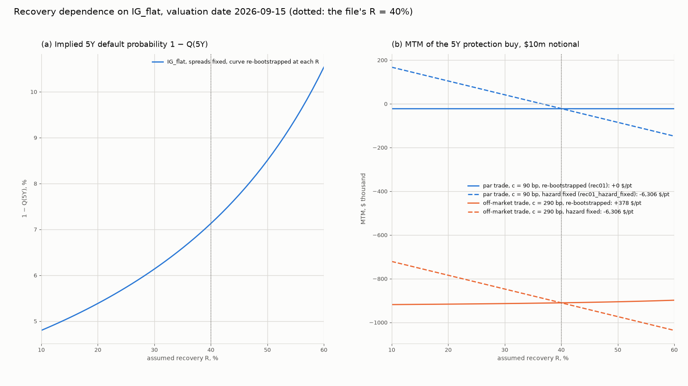
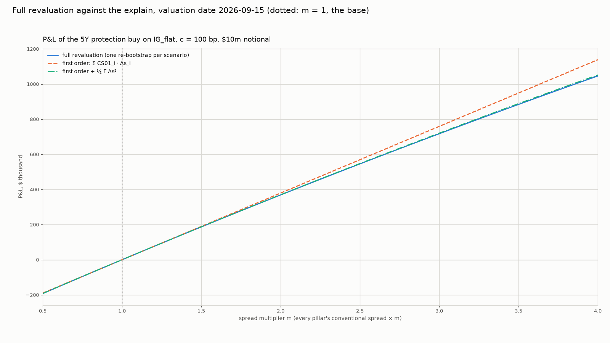
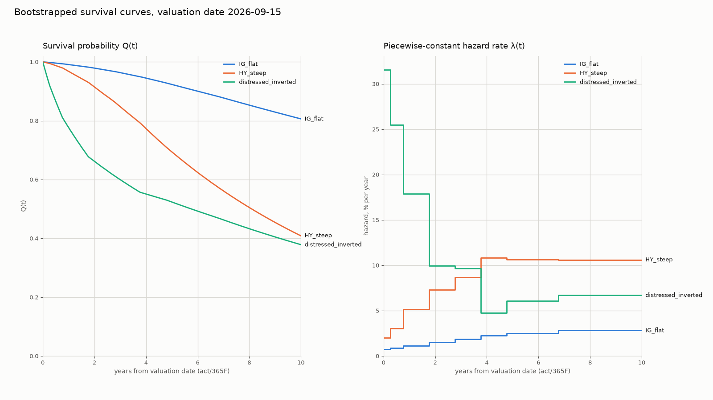

# CDS Pricing and Hazard Rate Bootstrapping

A single-name CDS library on the ISDA Standard Model conventions: a term
structure of market quotes (par spreads, or upfronts at a fixed coupon) is
bootstrapped into a piecewise-constant hazard rate curve on a SOFR OIS
discount curve, and a CDS is priced from it with the IMM schedule, act/360
accrual, accrual on default, T+3 cash settlement and the accrued rebate. On
top sit a risk report (CS01 by pillar and parallel, rec01 two ways, IR01,
jump-to-default, two thetas), a scenario grid and a P&L explain.
**The curves are illustrative** ([docs/DATA_NOTE.md](docs/DATA_NOTE.md))
**and the library is validated against QuantLib's `IsdaCdsEngine`**: Table 2
holds every pricer number, the 5Y CS01 and every bootstrapped hazard against
QuantLib, with the tolerance and the pass in the last two columns. Two rows
read `False`: the distressed curve's 1Y and 2Y hazards on our own pillar
grid, whose nodes sit one to three days from QuantLib's, miss the 0.5 bp bar
by 0.04 and 0.01 bp on a 25% and 18% hazard. The
`bootstrap_quantlib_nodes` rows fit the same quotes on QuantLib's dates and
agree on every pillar of every curve to under 1e-8 bp
([docs/CONVENTIONS_RESOLVED.md](docs/CONVENTIONS_RESOLVED.md) item 35).

<!-- table: table_2_quantlib_validation -->

| curve | trade | metric | ours | quantlib | diff | unit | tolerance | pass |
|---|---|---|---|---|---|---|---|---|
| IG_flat | 5Y_buy_c100 | clean_upfront_pct | -0.420378628 | -0.420378628 | 0.000000 | bp_of_notional | 1.000 | True |
| IG_flat | 5Y_buy_c100 | par_spread_bp | 90.000000000 | 90.000000000 | 0.000000 | bp | 0.500 | True |
| IG_flat | 5Y_buy_c100 | pv_protection | 0.037834077 | 0.037834077 | 0.000000 | bp_of_notional | 1.000 | True |
| IG_flat | 5Y_buy_c100 | risky_annuity | 4.442675169 | 4.442675169 | 0.000000 | per_unit_spread | 0.010 | True |
| IG_flat | 1Y_buy_c100 | clean_upfront_pct | -0.376993187 | -0.376993187 | 0.000000 | bp_of_notional | 1.000 | True |
| IG_flat | 1Y_buy_c100 | par_spread_bp | 50.000000000 | 50.000000000 | 0.000000 | bp | 0.500 | True |
| IG_flat | 1Y_buy_c100 | pv_protection | 0.003769932 | 0.003769932 | 0.000000 | bp_of_notional | 1.000 | True |
| IG_flat | 1Y_buy_c100 | risky_annuity | 0.992875264 | 0.992875264 | 0.000000 | per_unit_spread | 0.010 | True |
| IG_flat | 10Y_buy_c100 | clean_upfront_pct | 1.475586889 | 1.475586889 | 0.000000 | bp_of_notional | 1.000 | True |
| IG_flat | 10Y_buy_c100 | par_spread_bp | 120.000000000 | 120.000000000 | 0.000000 | bp | 0.500 | True |
| IG_flat | 10Y_buy_c100 | pv_protection | 0.088535213 | 0.088535213 | 0.000000 | bp_of_notional | 1.000 | True |
| IG_flat | 10Y_buy_c100 | risky_annuity | 7.616823336 | 7.616823336 | 0.000000 | per_unit_spread | 0.010 | True |
| HY_steep | 5Y_buy_c500 | clean_upfront_pct | 0.000000000 | 0.000000000 | 0.000000 | bp_of_notional | 1.000 | True |
| HY_steep | 5Y_buy_c500 | par_spread_bp | 500.000000000 | 500.000000000 | 0.000000 | bp | 0.500 | True |
| HY_steep | 5Y_buy_c500 | pv_protection | 0.191418741 | 0.191418741 | 0.000000 | bp_of_notional | 1.000 | True |
| HY_steep | 5Y_buy_c500 | risky_annuity | 4.067263712 | 4.067263712 | 0.000000 | per_unit_spread | 0.010 | True |
| distressed_inverted | 5Y_buy_c500 | clean_upfront_pct | 20.577817597 | 20.577817597 | 0.000000 | bp_of_notional | 1.000 | True |
| distressed_inverted | 5Y_buy_c500 | par_spread_bp | 1200.000000000 | 1200.000000000 | 0.000000 | bp | 0.500 | True |
| distressed_inverted | 5Y_buy_c500 | pv_protection | 0.352762587 | 0.352762587 | 0.000000 | bp_of_notional | 1.000 | True |
| distressed_inverted | 5Y_buy_c500 | risky_annuity | 3.178577117 | 3.178577117 | 0.000000 | per_unit_spread | 0.010 | True |
| IG_flat | bootstrap | hazard_pct_6M | 0.756456329 | 0.756456329 | 0.000000 | bp_of_hazard | 0.500 | True |
| IG_flat | bootstrap | hazard_pct_1Y | 0.885454072 | 0.885472346 | -0.001827 | bp_of_hazard | 0.500 | True |
| IG_flat | bootstrap | hazard_pct_2Y | 1.141963319 | 1.142002704 | -0.003939 | bp_of_hazard | 0.500 | True |
| IG_flat | bootstrap | hazard_pct_3Y | 1.497227301 | 1.497257617 | -0.003032 | bp_of_hazard | 0.500 | True |
| IG_flat | bootstrap | hazard_pct_4Y | 1.865280167 | 1.865313105 | -0.003294 | bp_of_hazard | 0.500 | True |
| IG_flat | bootstrap | hazard_pct_5Y | 2.248001253 | 2.248037284 | -0.003603 | bp_of_hazard | 0.500 | True |
| IG_flat | bootstrap | hazard_pct_7Y | 2.515082366 | 2.515110496 | -0.002813 | bp_of_hazard | 0.500 | True |
| IG_flat | bootstrap | hazard_pct_10Y | 2.818021993 | 2.818055735 | -0.003374 | bp_of_hazard | 0.500 | True |
| IG_flat | bootstrap_quantlib_nodes | hazard_pct_6M | 0.756456329 | 0.756456329 | 0.000000 | bp_of_hazard | 0.500 | True |
| IG_flat | bootstrap_quantlib_nodes | hazard_pct_1Y | 0.886905858 | 0.886905858 | 0.000000 | bp_of_hazard | 0.500 | True |
| IG_flat | bootstrap_quantlib_nodes | hazard_pct_2Y | 1.143404335 | 1.143404335 | 0.000000 | bp_of_hazard | 0.500 | True |
| IG_flat | bootstrap_quantlib_nodes | hazard_pct_3Y | 1.498229741 | 1.498229741 | -0.000000 | bp_of_hazard | 0.500 | True |
| IG_flat | bootstrap_quantlib_nodes | hazard_pct_4Y | 1.866321576 | 1.866321576 | 0.000000 | bp_of_hazard | 0.500 | True |
| IG_flat | bootstrap_quantlib_nodes | hazard_pct_5Y | 2.249085953 | 2.249085953 | 0.000000 | bp_of_hazard | 0.500 | True |
| IG_flat | bootstrap_quantlib_nodes | hazard_pct_7Y | 2.515474914 | 2.515474914 | 0.000000 | bp_of_hazard | 0.500 | True |
| IG_flat | bootstrap_quantlib_nodes | hazard_pct_10Y | 2.818332064 | 2.818332064 | 0.000000 | bp_of_hazard | 0.500 | True |
| IG_flat | 5Y_buy_c100_own_bootstrap | clean_upfront_pct | -0.420378628 | -0.420380476 | 0.000185 | bp_of_notional | 1.000 | True |
| IG_flat | 5Y_buy_c100 | cs01_usd | 4206.930352350 | 4206.940277573 | -0.009925 | usd | 50.000 | True |
| HY_steep | bootstrap | hazard_pct_6M | 2.017257387 | 2.017257387 | 0.000000 | bp_of_hazard | 0.500 | True |
| HY_steep | bootstrap | hazard_pct_1Y | 3.053053165 | 3.053253162 | -0.020000 | bp_of_hazard | 0.500 | True |
| HY_steep | bootstrap | hazard_pct_2Y | 5.133993205 | 5.134510330 | -0.051713 | bp_of_hazard | 0.500 | True |
| HY_steep | bootstrap | hazard_pct_3Y | 7.293708801 | 7.294102664 | -0.039386 | bp_of_hazard | 0.500 | True |
| HY_steep | bootstrap | hazard_pct_4Y | 8.689566352 | 8.689893521 | -0.032717 | bp_of_hazard | 0.500 | True |
| HY_steep | bootstrap | hazard_pct_5Y | 10.851142877 | 10.851660445 | -0.051757 | bp_of_hazard | 0.500 | True |
| HY_steep | bootstrap | hazard_pct_7Y | 10.616480898 | 10.616576389 | -0.009549 | bp_of_hazard | 0.500 | True |
| HY_steep | bootstrap | hazard_pct_10Y | 10.586268557 | 10.586355648 | -0.008709 | bp_of_hazard | 0.500 | True |
| HY_steep | bootstrap_quantlib_nodes | hazard_pct_6M | 2.017257387 | 2.017257387 | 0.000000 | bp_of_hazard | 0.500 | True |
| HY_steep | bootstrap_quantlib_nodes | hazard_pct_1Y | 3.064764226 | 3.064764226 | 0.000000 | bp_of_hazard | 0.500 | True |
| HY_steep | bootstrap_quantlib_nodes | hazard_pct_2Y | 5.145882562 | 5.145882562 | -0.000000 | bp_of_hazard | 0.500 | True |
| HY_steep | bootstrap_quantlib_nodes | hazard_pct_3Y | 7.300004368 | 7.300004368 | -0.000000 | bp_of_hazard | 0.500 | True |
| HY_steep | bootstrap_quantlib_nodes | hazard_pct_4Y | 8.693711898 | 8.693711898 | 0.000000 | bp_of_hazard | 0.500 | True |
| HY_steep | bootstrap_quantlib_nodes | hazard_pct_5Y | 10.857588875 | 10.857588875 | -0.000000 | bp_of_hazard | 0.500 | True |
| HY_steep | bootstrap_quantlib_nodes | hazard_pct_7Y | 10.616246235 | 10.616246235 | 0.000000 | bp_of_hazard | 0.500 | True |
| HY_steep | bootstrap_quantlib_nodes | hazard_pct_10Y | 10.586328350 | 10.586328350 | -0.000000 | bp_of_hazard | 0.500 | True |
| HY_steep | 5Y_buy_c500_own_bootstrap | clean_upfront_pct | 0.000000000 | 0.000000000 | -0.000000 | bp_of_notional | 1.000 | True |
| HY_steep | 5Y_buy_c500 | cs01_usd | 3828.119731551 | 3828.216058108 | -0.096327 | usd | 50.000 | True |
| distressed_inverted | bootstrap | hazard_pct_6M | 31.534459554 | 31.534459554 | 0.000000 | bp_of_hazard | 0.500 | True |
| distressed_inverted | bootstrap | hazard_pct_1Y | 25.487857776 | 25.482441270 | 0.541651 | bp_of_hazard | 0.500 | False |
| distressed_inverted | bootstrap | hazard_pct_2Y | 17.870113463 | 17.864997087 | 0.511638 | bp_of_hazard | 0.500 | False |
| distressed_inverted | bootstrap | hazard_pct_3Y | 9.961717513 | 9.961022275 | 0.069524 | bp_of_hazard | 0.500 | True |
| distressed_inverted | bootstrap | hazard_pct_4Y | 9.665770684 | 9.667011298 | -0.124061 | bp_of_hazard | 0.500 | True |
| distressed_inverted | bootstrap | hazard_pct_5Y | 4.733508491 | 4.733587869 | -0.007938 | bp_of_hazard | 0.500 | True |
| distressed_inverted | bootstrap | hazard_pct_7Y | 6.099480800 | 6.100649065 | -0.116827 | bp_of_hazard | 0.500 | True |
| distressed_inverted | bootstrap | hazard_pct_10Y | 6.693340038 | 6.693839087 | -0.049905 | bp_of_hazard | 0.500 | True |
| distressed_inverted | bootstrap_quantlib_nodes | hazard_pct_6M | 31.534459554 | 31.534459554 | 0.000000 | bp_of_hazard | 0.500 | True |
| distressed_inverted | bootstrap_quantlib_nodes | hazard_pct_1Y | 25.415196622 | 25.415196622 | -0.000000 | bp_of_hazard | 0.500 | True |
| distressed_inverted | bootstrap_quantlib_nodes | hazard_pct_2Y | 17.823512474 | 17.823512474 | 0.000000 | bp_of_hazard | 0.500 | True |
| distressed_inverted | bootstrap_quantlib_nodes | hazard_pct_3Y | 9.939422027 | 9.939422027 | -0.000000 | bp_of_hazard | 0.500 | True |
| distressed_inverted | bootstrap_quantlib_nodes | hazard_pct_4Y | 9.666262916 | 9.666262916 | -0.000000 | bp_of_hazard | 0.500 | True |
| distressed_inverted | bootstrap_quantlib_nodes | hazard_pct_5Y | 4.720036564 | 4.720036564 | 0.000000 | bp_of_hazard | 0.500 | True |
| distressed_inverted | bootstrap_quantlib_nodes | hazard_pct_7Y | 6.102540315 | 6.102540315 | -0.000000 | bp_of_hazard | 0.500 | True |
| distressed_inverted | bootstrap_quantlib_nodes | hazard_pct_10Y | 6.694379086 | 6.694379086 | 0.000000 | bp_of_hazard | 0.500 | True |
| distressed_inverted | 5Y_buy_c500_own_bootstrap | clean_upfront_pct | 20.577817597 | 20.576702232 | 0.111536 | bp_of_notional | 1.000 | True |
| distressed_inverted | 5Y_buy_c500 | cs01_usd | 2818.426930644 | 2818.591550459 | -0.164620 | usd | 50.000 | True |

<!-- end table -->

## Running it

```bash
UV_LINK_MODE=copy uv sync                       # Python 3.11, pinned dependencies incl. QuantLib 1.43
uv run pytest                                   # 397 tests, about a minute
uv run python scripts/make_outputs.py && uv run python scripts/make_results.py   # regenerate outputs/ and results.html
```

Everything under [outputs/](outputs/) is committed and is what this page
shows; [outputs/results.html](outputs/results.html) has the same tables and
charts on one page that opens offline.

## Four findings

**1. Recovery sensitivity depends on what is held fixed.** In Table 3 the row
`rec01` (spreads held fixed, curve re-bootstrapped at R + 1 point) is tens of
dollars on the IG par trade while `rec01_hazard_fixed` (hazards held fixed) is
thousands with the opposite sign. Both are right: a par trade's protection
value is pinned at s·A by the quotes, so raising R only moves the implied
hazard; hold the hazard instead and the protection leg falls with
(1 − R). Chart 2's panel (b) shows the four lines on IG with each slope in
the legend: the re-bootstrapped par-trade line is flat, and the
re-bootstrapped off-market line's small positive slope is the coupon
mismatch, not the recovery. Panel (a) shows the implied default probability
rising with the assumed R: not a model-free number.

<!-- table: table_3_risk_report -->

| measure | IG_flat 5Y_buy_c100 | HY_steep 5Y_buy_c500 | distressed_inverted 5Y_buy_c500 |
|---|---|---|---|
| mtm | -65926.75 | -119444.44 | 1938337.32 |
| cs01_6m | 0.13 | 0.00 | -2.81 |
| cs01_1y | 0.76 | 0.00 | -17.74 |
| cs01_2y | 2.39 | 0.00 | -62.67 |
| cs01_3y | 3.86 | 0.00 | -113.52 |
| cs01_4y | 5.42 | 0.00 | -180.82 |
| cs01_5y | 4206.93 | 3828.12 | 2818.43 |
| cs01_7y | 0.00 | 0.00 | 0.00 |
| cs01_10y | 0.00 | 0.00 | 0.00 |
| cs01_bucket_sum | 4219.49 | 3828.12 | 2440.86 |
| cs01_parallel | 4218.23 | 3827.24 | 2440.43 |
| cs01_central_6m | 0.13 | 0.00 | -2.81 |
| cs01_central_1y | 0.76 | 0.00 | -17.74 |
| cs01_central_2y | 2.39 | 0.00 | -62.67 |
| cs01_central_3y | 3.86 | 0.00 | -113.52 |
| cs01_central_4y | 5.42 | 0.00 | -180.81 |
| cs01_central_5y | 4207.28 | 3828.37 | 2818.61 |
| cs01_central_7y | 0.00 | 0.00 | 0.00 |
| cs01_central_10y | 0.00 | 0.00 | 0.00 |
| cs01_central_parallel | 4219.84 | 3828.38 | 2441.05 |
| rec01 | 20.42 | 0.00 | -9063.74 |
| rec01_hazard_fixed | -6305.68 | -25522.50 | -44095.32 |
| ir01 | 9.75 | 0.00 | -399.26 |
| jtd | 6042315.64 | 7501388.89 | 5943607.13 |
| theta_calendar_1d | -146.61 | -453.30 | -4511.60 |
| theta_rolldown_1d | -363.41 | -1909.29 | -831.11 |
| theta_calendar_1m | -3912.60 | -12453.69 | -148609.73 |
| theta_rolldown_1m | -10424.40 | -56263.05 | -36678.82 |

<!-- end table -->



**2. The textbook model is not the ISDA model.** Table 5 prices each pillar
contract both ways: the ISDA path on the full bootstrapped curve, and the
continuous-time formula s = λ(1 − R) at the flat hazard the same spread
implies. Read `diff_par_bp` and `diff_bp`: the textbook overstates the par
spread on every row and misprices the distressed 5Y and 10Y upfronts by over
a point.
Four conventions make the gap: act/360 accrual against continuous time (the
365/360 alone is 1.4% of the spread); quarterly coupons with accrual on
default against a continuous premium; the IMM schedule, whose first coupon is
paid in full and rebated, against a contract accruing from today; and a term
structure of hazards on a discount curve against one flat hazard at one flat
rate, which is what fails on the inverted distressed curve.

<!-- table: table_5_isda_vs_textbook -->

| curve | tenor | coupon_bp | isda_clean_upfront_pct | textbook_upfront_pct | diff_bp | isda_par_spread_bp | textbook_par_spread_bp | diff_par_bp |
|---|---|---|---|---|---|---|---|---|
| IG_flat | 1Y | 100 | -0.376993 | -0.370420 | -0.6573 | 50.000000 | 50.420679 | -0.4207 |
| IG_flat | 5Y | 100 | -0.420379 | -0.384020 | -3.6358 | 90.000000 | 90.727550 | -0.7276 |
| IG_flat | 10Y | 100 | 1.475587 | 1.510754 | -3.5167 | 120.000000 | 120.963985 | -0.9640 |
| HY_steep | 1Y | 500 | -2.247990 | -2.213245 | -3.4745 | 200.000000 | 201.688833 | -1.6888 |
| HY_steep | 5Y | 500 | 0.000000 | 0.150802 | -15.0802 | 500.000000 | 504.087502 | -4.0875 |
| HY_steep | 10Y | 500 | 5.857239 | 5.886742 | -2.9503 | 600.000000 | 604.888966 | -4.8890 |
| distressed_inverted | 1Y | 500 | 11.547532 | 11.623698 | -7.6166 | 2200.000000 | 2219.488678 | -19.4887 |
| distressed_inverted | 5Y | 500 | 20.577818 | 21.969193 | -139.1376 | 1200.000000 | 1209.987990 | -9.9880 |
| distressed_inverted | 10Y | 500 | 20.730814 | 22.180715 | -144.9901 | 950.000000 | 957.811464 | -7.8115 |

<!-- end table -->

**3. Theta on a steep curve and on an inverted one.** Table 3's last four
rows are the 1-day and 1-month thetas, each computed two ways: the calendar
moves and the curve stays on its dates (`theta_calendar`), or the curve rolls
with the calendar so the contract prices off a shorter tenor
(`theta_rolldown`). On `HY_steep` a month of rolldown costs the protection
buyer over four times the calendar theta: the 5Y point rolls towards the
lower 4Y spread. On `distressed_inverted` it is the other way round: the
calendar theta is the larger by a factor of four, because the month that
passes carried a 31.5% front-end hazard, and rolling onto the higher shorter
spreads gives most of it back. The 1-month window holds the first coupon,
which both thetas net out.

**4. A P&L explain is only as good as its second-order terms.** Table 4
explains the 5Y IG buy under six scenarios with the t₀ sensitivities:
first order from the per-pillar CS01s, ½Γ Δs² with Γ read from the parallel
and central CS01s, rec01 × ΔR, IR01 × Δr, the cross term, and a residual.
Read `residual_pct_of_total`: under half a percent on every spread scenario,
including ×3. Chart 3 sweeps the multiplier from 0.5 to 4: the full
revaluation is concave (the buyer is short convexity), first order is the
straight line, and the gamma line sits between them at every point. The bar
the suite asserts on the steep HY curve at ×3: first order alone leaves a
residual over 5% of the P&L, and the gamma term removes at least half of it
(26% to 3.2%; rows in
[review/09_scenarios_explain.md](review/09_scenarios_explain.md)). The
recovery row's large percentage is a $100 residual on a $300 P&L: the MTM is
convex in R and the explain has no second-order recovery term.

<!-- table: table_4_pnl_explain -->

| scenario | pnl_full | pnl_spread_first_order | pnl_spread_gamma | pnl_recovery | pnl_rates | pnl_theta | pnl_cross | residual | residual_pct_of_total |
|---|---|---|---|---|---|---|---|---|---|
| spread_x1.5 | 187080.58 | 189757.30 | -2416.81 | 0.00 | 0.00 | 0.00 | 0.00 | -259.92 | -0.14 |
| spread_x3 | 717179.06 | 759029.22 | -38668.92 | 0.00 | 0.00 | 0.00 | 0.00 | -3181.24 | -0.44 |
| recovery_0.2 | -302.71 | 0.00 | 0.00 | -408.43 | 0.00 | 0.00 | 0.00 | 105.72 | -34.92 |
| steepen_35bp | 104674.53 | 105367.16 | -492.92 | 0.00 | 0.00 | 0.00 | 0.00 | -199.71 | -0.19 |
| rates_+100bp | 956.12 | 0.00 | 0.00 | 0.00 | 975.28 | 0.00 | 0.00 | -19.16 | -2.00 |
| combined | 381373.80 | 379514.61 | -9667.23 | -408.43 | -975.28 | 0.00 | 2800.65 | 10109.48 | 2.65 |

<!-- end table -->



## The CDS–bond basis

The basis is the CDS par spread of a name less its bond's spread over the
same risk-free curve, usually the Z-spread: basis = s_CDS − z. At zero the
two markets price the same default risk the same way; a negative basis says
protection is cheap relative to the bond (buy the bond, buy protection, earn
the difference if the package can be funded to maturity), a positive one the
reverse. Three things keep it from zero. Funding: the bond must be financed
and the CDS need not, so when balance-sheet costs rise the bond cheapens and
the basis turns negative. The cheapest-to-deliver option: after a credit
event the protection buyer may deliver any pari passu obligation, which is
worth something and pushes the CDS spread above the bond's. And the contract
itself: a standard CDS runs at a fixed 100 or 500 bp coupon with an upfront,
so the quoted par spread is a conversion, not the running cost paid.

Worked example. Table 1's `IG_flat` 5Y row gives a par spread of 90 bp.
Take a 5Y bond of the same name at an assumed Z-spread of 110 bp over the
same SOFR OIS curve. The basis is 90 − 110 = −20 bp: negative, of the size a
funding cost of a few tens of bp produces on its own, and the sign that
lets bond-plus-protection earn 20 bp a year if funded at the curve to
maturity. The bond spread is assumed; the CDS side is the library's.

<!-- table: table_1_hazard_curves -->

| curve | pillar | maturity | quote_kind | quote | coupon_bp | conventional_spread_bp | method | hazard_pct | survival_prob | cum_default_prob |
|---|---|---|---|---|---|---|---|---|---|---|
| IG_flat | 6M | 2026-12-20 | par_spread_bp | 45.000000 |  | 45.000000 | bootstrap | 0.7565 | 0.998012 | 0.001988 |
| IG_flat | 1Y | 2027-06-20 | par_spread_bp | 50.000000 |  | 50.000000 | bootstrap | 0.8855 | 0.993616 | 0.006384 |
| IG_flat | 2Y | 2028-06-20 | par_spread_bp | 60.000000 |  | 60.000000 | bootstrap | 1.1420 | 0.982303 | 0.017697 |
| IG_flat | 3Y | 2029-06-20 | par_spread_bp | 70.000000 |  | 70.000000 | bootstrap | 1.4972 | 0.967705 | 0.032295 |
| IG_flat | 4Y | 2030-06-20 | par_spread_bp | 80.000000 |  | 80.000000 | bootstrap | 1.8653 | 0.949822 | 0.050178 |
| IG_flat | 5Y | 2031-06-20 | par_spread_bp | 90.000000 |  | 90.000000 | bootstrap | 2.2480 | 0.928708 | 0.071292 |
| IG_flat | 7Y | 2033-06-20 | par_spread_bp | 105.000000 |  | 105.000000 | bootstrap | 2.5151 | 0.883087 | 0.116913 |
| IG_flat | 10Y | 2036-06-20 | par_spread_bp | 120.000000 |  | 120.000000 | bootstrap | 2.8180 | 0.811436 | 0.188564 |
| HY_steep | 6M | 2026-12-20 | par_spread_bp | 150.000000 |  | 150.000000 | bootstrap | 2.0173 | 0.994708 | 0.005292 |
| HY_steep | 1Y | 2027-06-20 | par_spread_bp | 200.000000 |  | 200.000000 | bootstrap | 3.0531 | 0.979680 | 0.020320 |
| HY_steep | 2Y | 2028-06-20 | par_spread_bp | 300.000000 |  | 300.000000 | bootstrap | 5.1340 | 0.930522 | 0.069478 |
| HY_steep | 3Y | 2029-06-20 | par_spread_bp | 380.000000 |  | 380.000000 | bootstrap | 7.2937 | 0.865068 | 0.134932 |
| HY_steep | 4Y | 2030-06-20 | par_spread_bp | 440.000000 |  | 440.000000 | bootstrap | 8.6896 | 0.793071 | 0.206929 |
| HY_steep | 5Y | 2031-06-20 | par_spread_bp | 500.000000 |  | 500.000000 | bootstrap | 10.8511 | 0.711518 | 0.288482 |
| HY_steep | 7Y | 2033-06-20 | par_spread_bp | 560.000000 |  | 560.000000 | bootstrap | 10.6165 | 0.575236 | 0.424764 |
| HY_steep | 10Y | 2036-06-20 | par_spread_bp | 600.000000 |  | 600.000000 | bootstrap | 10.5863 | 0.418595 | 0.581405 |
| distressed_inverted | 6M | 2026-12-20 | upfront_pct | 5.069354 | 500 | 2500.000000 | bootstrap | 31.5345 | 0.920406 | 0.079594 |
| distressed_inverted | 1Y | 2027-06-20 | upfront_pct | 11.601337 | 500 | 2200.000000 | bootstrap | 25.4879 | 0.810560 | 0.189440 |
| distressed_inverted | 2Y | 2028-06-20 | upfront_pct | 18.410749 | 500 | 1800.000000 | bootstrap | 17.8701 | 0.677585 | 0.322415 |
| distressed_inverted | 3Y | 2029-06-20 | upfront_pct | 20.558946 | 500 | 1500.000000 | bootstrap | 9.9617 | 0.613339 | 0.386661 |
| distressed_inverted | 4Y | 2030-06-20 | upfront_pct | 22.141928 | 500 | 1350.000000 | bootstrap | 9.6658 | 0.556830 | 0.443170 |
| distressed_inverted | 5Y | 2031-06-20 | upfront_pct | 21.869332 | 500 | 1200.000000 | bootstrap | 4.7335 | 0.531086 | 0.468914 |
| distressed_inverted | 7Y | 2033-06-20 | upfront_pct | 21.868745 | 500 | 1050.000000 | bootstrap | 6.0995 | 0.470016 | 0.529984 |
| distressed_inverted | 10Y | 2036-06-20 | upfront_pct | 22.034981 | 500 | 950.000000 | bootstrap | 6.6933 | 0.384439 | 0.615561 |
| distressed_arb | 6M | 2026-12-20 | upfront_pct | 13.182068 | 500 | 6000.000000 | upfront | 75.7359 | 0.819389 | 0.180611 |
| distressed_arb | 1Y | 2027-06-20 | upfront_pct | 11.601337 | 500 | 2200.000000 | upfront | 27.7436 | 0.809525 | 0.190475 |
| distressed_arb | 2Y | 2028-06-20 | upfront_pct | 18.410749 | 500 | 1800.000000 | upfront | 22.6929 | 0.670059 | 0.329941 |
| distressed_arb | 3Y | 2029-06-20 | upfront_pct | 20.558946 | 500 | 1500.000000 | upfront | 18.9076 | 0.592930 | 0.407070 |
| distressed_arb | 4Y | 2030-06-20 | upfront_pct | 22.141928 | 500 | 1350.000000 | upfront | 17.0161 | 0.527003 | 0.472997 |
| distressed_arb | 5Y | 2031-06-20 | upfront_pct | 21.869332 | 500 | 1200.000000 | upfront | 15.1248 | 0.486457 | 0.513543 |
| distressed_arb | 7Y | 2033-06-20 | upfront_pct | 21.868745 | 500 | 1050.000000 | upfront | 13.2336 | 0.408389 | 0.591611 |
| distressed_arb | 10Y | 2036-06-20 | upfront_pct | 22.034981 | 500 | 950.000000 | upfront | 11.9726 | 0.310457 | 0.689543 |

<!-- end table -->

## Implied against historical default rates

Chart 2's CSV puts the IG curve's implied 5Y default probability at 7.13%
at the file's R = 0.40 (`implied_5y_default_prob` on the `recovery = 0.4`
row; Table 1's IG 5Y `cum_default_prob` is the same number). S&P Global
Ratings' *Default, Transition, and Recovery: 2020 Annual Global Corporate
Default And Rating Transition Study* (7 April 2021), Table 24 "Global
Corporate Average Cumulative Default Rates (1981–2020)", gives the BBB
five-year cumulative default rate as 1.54%. The market-implied number is
four and a half times the historical one. That gap is the risk-neutral
against real-world point: a CDS spread pays for default risk and for bearing
it, and nothing in this library separates the two. (Later editions were not
retrievable when this was written; [docs/DATA_NOTE.md](docs/DATA_NOTE.md)
links the copy read.)



## Conventions

Every convention is in [cds/conventions.py](cds/conventions.py) and every
decision taken during the build is numbered in
[docs/CONVENTIONS_RESOLVED.md](docs/CONVENTIONS_RESOLVED.md). The ones a reader
of the numbers needs:

- IMM dates, semi-annual maturity roll, accrual from the IMM date on or
  before step-in, Following adjustment, last period to maturity + 1 day.
- Accrual act/360; time in act/365 fixed years from the valuation date.
- Protection from step-in (T+1); PVs at cash settlement (T+3); the seller
  rebates accrued.
- Par spread is the clean-value spread, QuantLib's `fairSpread` (item 24);
  upfront quotes are clean (item 25).
- Every bump holds the conventional spreads fixed and re-bootstraps (item
  40); Γ is the second difference, negative for the buyer (item 47).
- The protection buyer's MTM is positive when spreads widen; `sell` negates;
  notional 10,000,000.

## Limitations

- The ISDA C library (cdsmodel.com) was not run; QuantLib's `IsdaCdsEngine`
  and its bootstrap are the reference.
- The curves are illustrative and the rates snapshot is one day (15
  September 2026); nothing here is an observation of any name.
- The OIS curve uses spot = valuation date (T+0), not the market's T+2
  (item 13); under 0.1 bp on a 5Y upfront.
- The `us_uk` holiday calendar is committed and tested on dates, but every
  number in outputs/ is on the weekend-only calendar; the `us_uk` path
  through the pricer, risk report and explain is untested.
- The explain has no second-order recovery or rates–spread term; Table 4's
  recovery and combined rows show what that leaves.

## Section reviews

Each section of the build ends with a review file carrying the rows behind
every number it claims:
[01 schedule](review/01_schedule.md),
[02 discount curve](review/02_discount.md),
[03 survival curve](review/03_survival.md),
[04 legs](review/04_legs.md),
[05 pricer](review/05_pricer.md),
[06 bootstrap](review/06_bootstrap.md),
[07 QuantLib validation](review/07_quantlib_validation.md),
[08 risk](review/08_risk.md),
[09 scenarios and explain](review/09_scenarios_explain.md),
[10 README and results page](review/10_readme_results.md).
Spec: [docs/SPEC.md](docs/SPEC.md); plan: [BUILD_PLAN.md](BUILD_PLAN.md).
